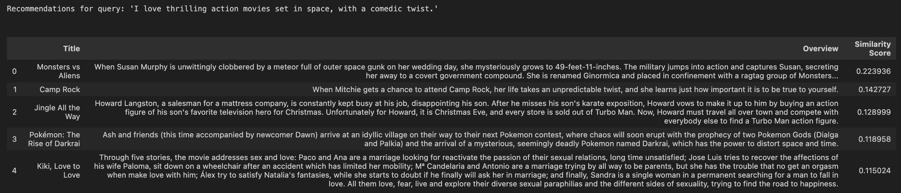

# AI/Machine Learning Intern Challenge: Simple Content-Based Recommendation

**Deadline**: Sunday, Feb 23th 11:59 pm PST

---

## Dataset:
This analysis uses a curated dataset of 500 movies, randomly sampled from Kaggle's "Top Rated Movies" collection ([View Dataset](https://www.kaggle.com/datasets/yashkmd/top-rated-movies)). The dataset spans multiple decades and includes the top rated films. The sampled data can be found in `data.csv` within this repository.

## Setup:
- The python version used is Python 3.10.1
- Install Dependencies: Run the following command to install required packages:

  **pip install -r requirements.txt**
- Jupyter Notebook: This project was created in a Jupyter Notebook. To open it, run the line below before opening the file:

  **jupyter notebook**

## Running:
- Open Jupyter Notebook and load model.ipynb.
- Run all the cells in order.
- Enter your input string when prompted.
= The system will display 5 recommended movies based on your input.

## Results:

  

